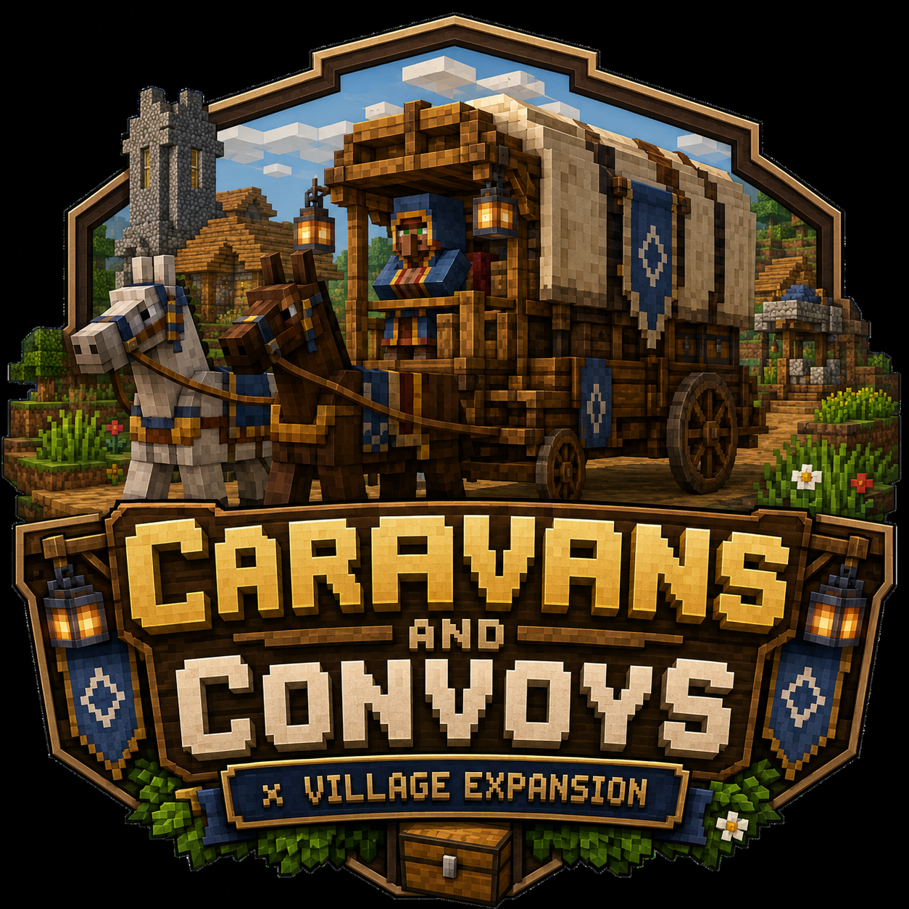
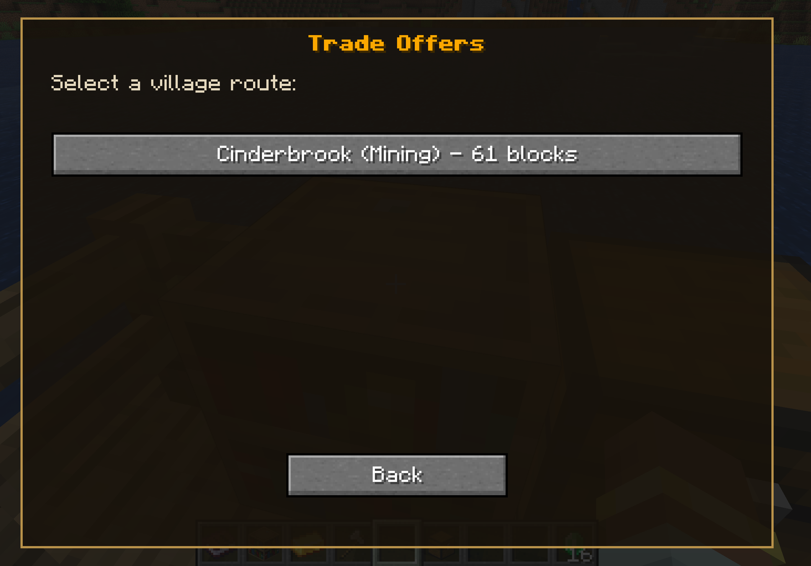
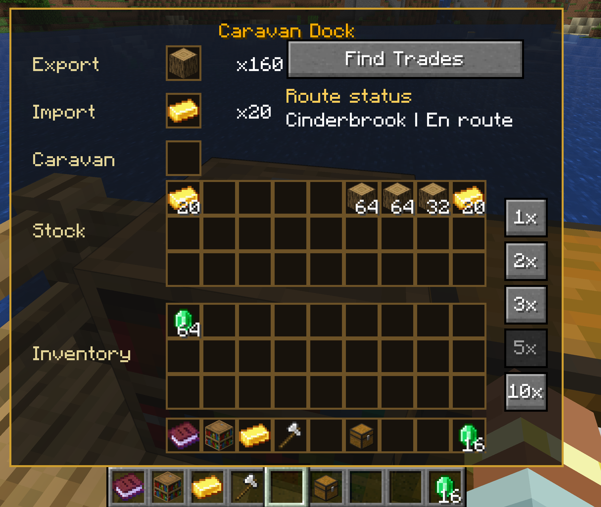
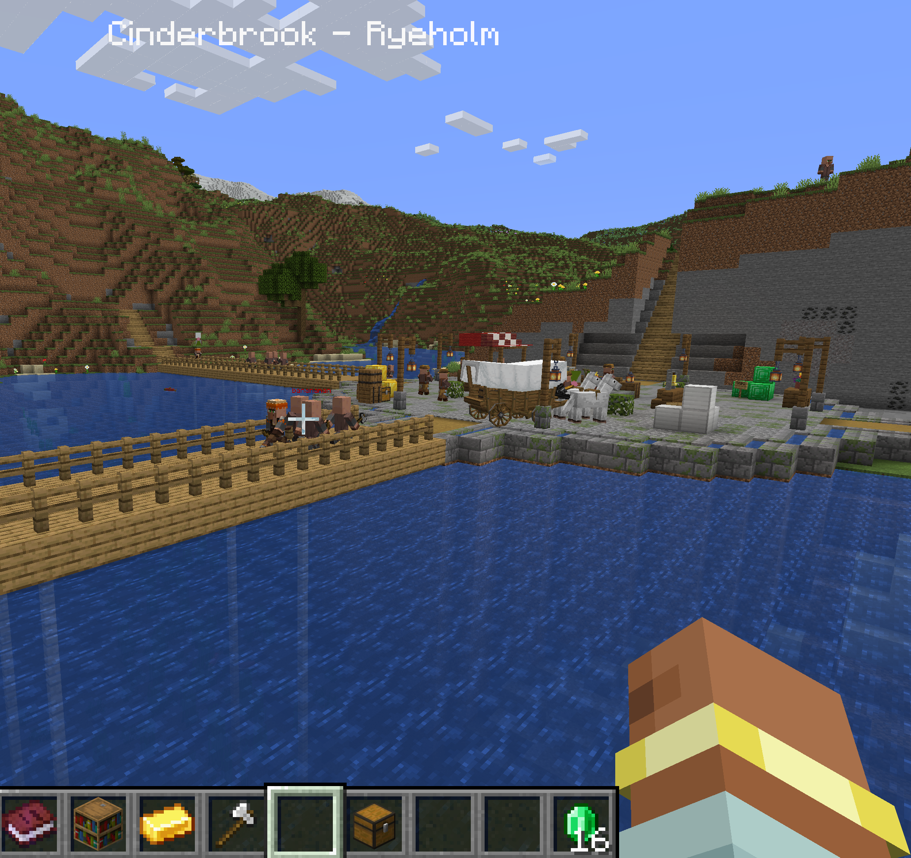

# Caravans & Convoys × Village Expansion Compat



Bridges **[Caravans & Convoys](https://www.curseforge.com/minecraft/mc-mods/caravans-and-convoys)** wagon trade with **[Villager Recruits: Village Expansion](https://www.curseforge.com/minecraft/mc-mods/villager-recruits-village-expansion)**, letting your caravans run real, continuous trade routes between your docks and Villager Recruits villages.

**Minecraft 1.20.1 · Forge 47.4+ · MIT licensed**

## Features

### Village trade docks with typed catalogs
Every Villager Recruits village automatically gets a caravan dock with a trade catalog based on its specialization — **Farming, Forestry, Mining, Merchant, or Military**. Villages sell goods matching their type and always pay emeralds for items they buy.

### Sell anything with a defined price
Villages buy any item that has a configured price, regardless of village type, at half the emerald value of the forward trade. Village *sales* stay type-restricted, so a mining village never sells you wheat.

### Computed barter offers
Put any priced item in the dock's **Export** sample slot and any item the village sells in the **Import** sample slot — no pre-defined trade needed. The server computes whole-number quantities by equalizing emerald value via least common multiple:

> 1 iron block sells for 2 emeralds, 16 oak logs cost 3 emeralds → the generated offer is **3 iron blocks for 32 oak logs** (6 emerald value each side).

### Bulk trade multipliers
The dock UI offers **1×, 2×, 3×, 5×, and 10×** buttons that scale both sides of any trade. Pick a multiplier before or after selecting a route — the dock remembers it and every wagon trip honors it.

### Reliable wagon dispatch
Wagons are redispatched the moment they return home, and a safety-net poll recovers stalled routes, so trade loops keep running without babysitting.

### Public player docks (optional)
Server config can allow any player to access and edit player-owned caravan docks (village docks always stay protected).

## Screenshots

| | |
|---|---|
|  |  |
|  | |

## Requirements

| Mod | Version |
|---|---|
| Minecraft | 1.20.1 |
| Forge | 47.4 or newer |
| [Caravans & Convoys](https://www.curseforge.com/minecraft/mc-mods/caravans-and-convoys) | 1.0.5+ |
| [Villager Recruits: Village Expansion](https://www.curseforge.com/minecraft/mc-mods/villager-recruits-village-expansion) | 1.0.7.93TC-80+ |

(GeckoLib, Trotting Wagons, and other dependencies of the mods above install automatically when your launcher resolves their requirements.)

## How to use

1. Place a **Caravan Dock** (from Caravans & Convoys), attach an inventory (chest) behind it, and put a wagon in the caravan slot.
2. Open the dock and press **Find Trades** to list village routes and their offers.
3. *(Optional)* Press a multiplier button (1×–10×) to trade in bulk.
4. Select a route — the wagon loads from your chest, drives to the village, trades, and comes back with the goods. It redispatches automatically while stock lasts.
5. For **barter**, place a sample item you want to *give* in Export and a sample item you want to *receive* in Import, then Find Trades to see computed offers.

## Configuration

All config lives in `config/cacxvecompat/`:

- **`cacxvecompat-common.toml`**
  - `allowPublicCaravanDocks` (default `false`) — when true, anyone can use player-owned docks.
- **`trades/*.json`** — the trade catalogs, one file per village type (`generic`, `farming`, `forestry`, `mining`, `merchant`, `military`). Each entry maps a village-export item + quantity to an emerald price; the mod automatically adds the reverse (sell-to-village) trade at half value. Edit or add entries to customize your economy — no restart needed beyond a world reload.
- **`village-types.json`** — optional overrides pinning specific villages to specific types.

## Building from source

```
gradlew build
```

The build expects the dependency jars (Caravans & Convoys, Village Expansion, etc.) in `libs/`. These are third-party mods and are intentionally not committed to this repository — download them from CurseForge/Modrinth. Unit tests run via `gradlew test`; live in-game GameTests via `gradlew runGameTestServer`.

## Issues & source

- Source: https://github.com/AnthonyNGarcia/CACVXECompat
- Bug reports: https://github.com/AnthonyNGarcia/CACVXECompat/issues
